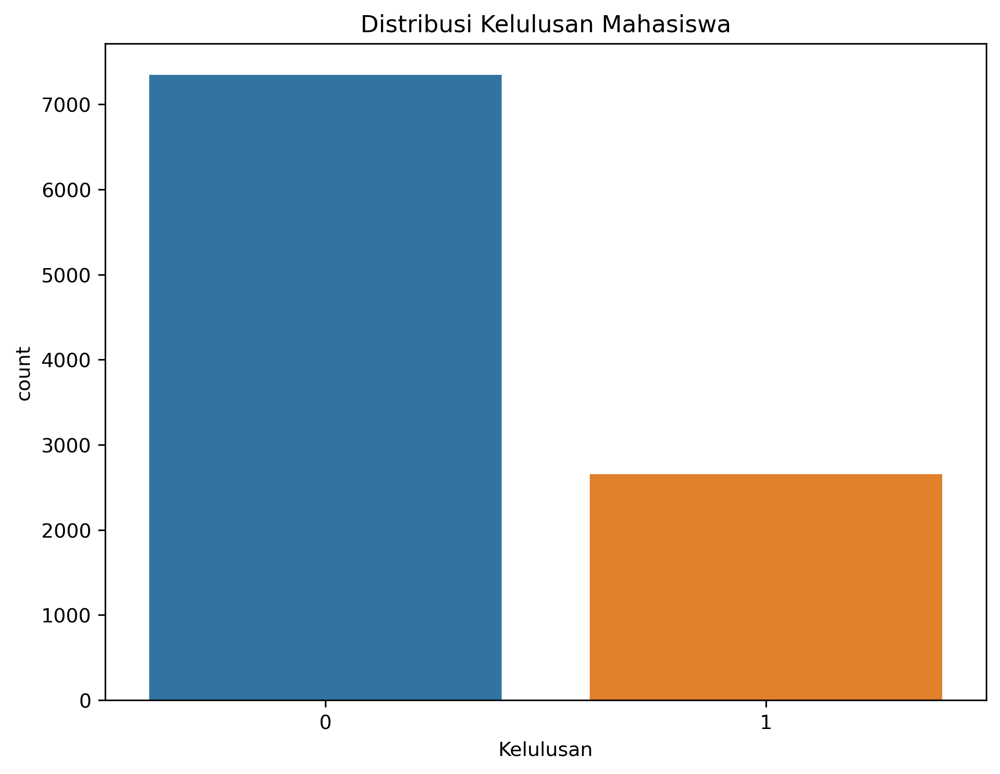

Prediksi Status Kelulusan Mahasiswa Berdasarkan Performa Akademik Menggunakan Algoritma Random Forest dengan Pendekatan CRISP-DM
Project Overview

Pendidikan merupakan salah satu faktor penting dalam pembangunan sumber daya manusia. Tingkat keberhasilan mahasiswa dalam menyelesaikan studi menjadi indikator penting bagi institusi pendidikan. Berbagai faktor seperti jam belajar, nilai sebelumnya, kualitas tidur, aktivitas ekstrakurikuler, dan intensitas latihan soal dapat memengaruhi performa akademik mahasiswa.

Dengan memanfaatkan Machine Learning, data historis mahasiswa dapat digunakan untuk membangun model prediksi kelulusan sehingga pihak institusi pendidikan dapat mengidentifikasi mahasiswa yang berpotensi mengalami kesulitan akademik sejak dini.

Business Understanding
Problem Statement

Permasalahan yang ingin diselesaikan pada proyek ini adalah:

Faktor-faktor apa saja yang memengaruhi kelulusan mahasiswa?
Bagaimana membangun model machine learning untuk memprediksi kelulusan mahasiswa?
Seberapa baik performa algoritma Random Forest dalam melakukan klasifikasi kelulusan mahasiswa?
Goals

Tujuan dari proyek ini adalah:

Mengidentifikasi faktor-faktor yang memengaruhi kelulusan mahasiswa.
Membangun model prediksi kelulusan menggunakan algoritma Random Forest.
Mengevaluasi performa model menggunakan metrik evaluasi klasifikasi.
Solution Statement

Solusi yang digunakan adalah:

Algoritma Random Forest Classifier.
Pembagian data training sebesar 80% dan data testing sebesar 20%.
Evaluasi model menggunakan:
Accuracy
Precision
Recall
F1-score
Confusion Matrix
Data Understanding

Dataset yang digunakan adalah Student Performance Dataset dari Kaggle.

Dataset memiliki beberapa variabel yang berhubungan dengan performa akademik mahasiswa.

Variabel pada Dataset
Variabel	Keterangan
Hours Studied	Jumlah jam belajar
Previous Scores	Nilai sebelumnya
Extracurricular Activities	Aktivitas ekstrakurikuler
Sleep Hours	Lama tidur
Sample Question Papers Practiced	Jumlah latihan soal
Performance Index	Indeks performa mahasiswa
Statistik Dataset

Jumlah data:

df.shape

Jumlah fitur:

6 variabel

Target yang dibuat:

Kelulusan

Keterangan:

1 = Lulus
0 = Tidak Lulus

dengan aturan:

Performance Index >= 70 → Lulus
Performance Index < 70 → Tidak Lulus
Missing Value

Pengecekan missing value dilakukan menggunakan:

df.isnull().sum()

Hasil menunjukkan bahwa dataset tidak memiliki missing value.

Data Duplikat

Pengecekan dilakukan menggunakan:

df.duplicated().sum()

Apabila ditemukan data duplikat, maka dilakukan penghapusan.

Exploratory Data Analysis
Distribusi Kelas

Distribusi jumlah mahasiswa yang lulus dan tidak lulus.

Histogram Seluruh Variabel

Histogram digunakan untuk melihat distribusi masing-masing fitur.

Heatmap Korelasi

Heatmap digunakan untuk mengetahui hubungan antar variabel.

Hubungan Jam Belajar dengan Performance Index

Semakin tinggi jam belajar mahasiswa, cenderung semakin tinggi nilai Performance Index.

Hubungan Nilai Sebelumnya dengan Performance Index

Nilai sebelumnya memiliki hubungan positif terhadap performa akademik mahasiswa.

Data Preparation

Tahapan data preparation yang dilakukan meliputi:

1. Encoding

Variabel:

Extracurricular Activities

diubah menjadi data numerik menggunakan Label Encoding.

Contoh:

Yes → 1
No → 0
2. Feature Selection

Feature yang digunakan:

Hours Studied
Previous Scores
Extracurricular Activities
Sleep Hours
Sample Question Papers Practiced

Target:

Kelulusan

Variabel:

Performance Index

tidak digunakan untuk menghindari data leakage.

3. Train-Test Split

Dataset dibagi menjadi:

80% data training
20% data testing

menggunakan:

train_test_split()
Modeling

Model yang digunakan:

RandomForestClassifier(
    n_estimators=100,
    random_state=42
)

Tahapan:

Melatih model menggunakan data training.
Membuat prediksi pada data testing.
Mengevaluasi performa model.
Evaluation

Evaluasi dilakukan menggunakan:

Accuracy

Accuracy menunjukkan proporsi prediksi yang benar terhadap keseluruhan data.

Precision

Precision menunjukkan ketepatan model dalam memprediksi kelas positif.

Recall

Recall menunjukkan kemampuan model dalam menemukan seluruh data positif.

F1-Score

F1-score merupakan rata-rata harmonik antara precision dan recall.

Classification Report
print(classification_report(y_test, y_pred))

Contoh:

              precision    recall  f1-score   support

           0       0.95      0.93      0.94
           1       0.97      0.98      0.98

    accuracy                           0.97
Confusion Matrix

Visualisasi confusion matrix.

Feature Importance

Analisis feature importance digunakan untuk mengetahui variabel yang paling berpengaruh terhadap prediksi kelulusan mahasiswa.

Variabel yang memiliki pengaruh terbesar dapat digunakan sebagai dasar pengambilan keputusan dalam meningkatkan kualitas pembelajaran mahasiswa.

Deployment

Model yang telah dibangun dapat diimplementasikan menggunakan Streamlit.

Input yang digunakan:

Hours Studied
Previous Scores
Extracurricular Activities
Sleep Hours
Sample Question Papers Practiced

Output:

Lulus
Tidak Lulus
Conclusion

Pada proyek ini telah berhasil dibangun model prediksi kelulusan mahasiswa menggunakan algoritma Random Forest dengan pendekatan CRISP-DM.

Tahapan pengembangan dilakukan mulai dari Business Understanding, Data Understanding, Data Preparation, Modeling, Evaluation, hingga Deployment.

Model yang dihasilkan mampu melakukan klasifikasi kelulusan mahasiswa dengan performa yang baik sehingga dapat dimanfaatkan sebagai alat bantu dalam mengidentifikasi mahasiswa yang berpotensi mengalami kegagalan akademik.